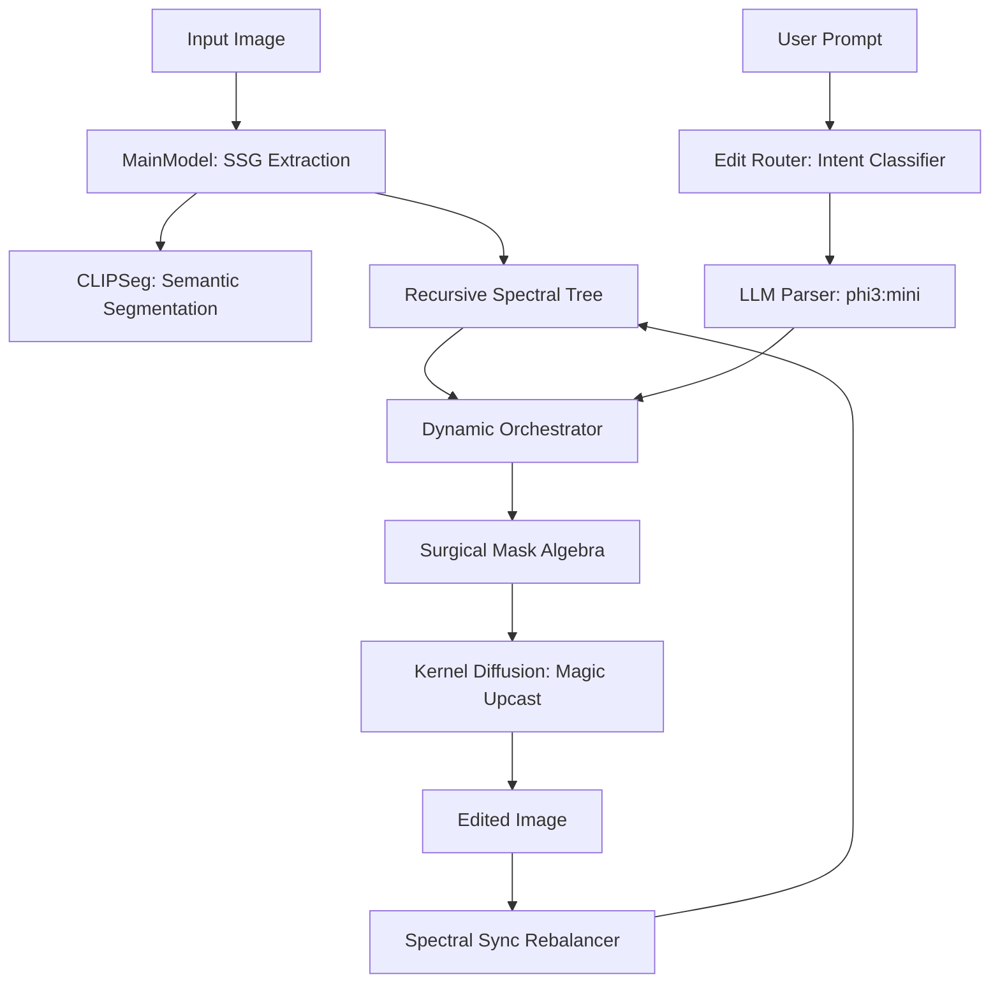

# SPECTRA Technical Architecture

The Spectral Semantic Graph (SSG) is a hierarchical editing pipeline designed for **Surgical Image Manipulation**. Unlike standard diffusion pipelines that treat images as flat pixels, SSG decomposes the image into a semantic tree.

## System Overview

## Core Components

### 1. SSG Extraction (`main_model.py`)
Constructs a recursive quad-tree of the image. It injects **Authoritative Semantic Nodes** (Hair, Face, Suit) using CLIPSeg. This ensures the system understands anatomy before it attempts to edit.

### 2. Edit Router (`edit_router.py`)
A lightweight fingerprint-based classifier that identifies the user's intent (e.g., `GLOBAL_PERSON`, `LIGHTING`) before the LLM. This provides a "Routing Hint" to the LLM, significantly improving reliability under resource constraints.

### 3. LLM Parser (`llm_parser.py`)
Uses **phi3:mini** (via Ollama) to map the natural language intent to specific SSG nodes and influence vectors ($ZT$, $ZL$, $ZB$).
*   **Memory Hygiene**: Our implementation forcefully unloads the LLM immediately after use to reclaim 5GB of System RAM for the diffusion kernel.

### 4. Dynamic Orchestrator (`dynamic_orchestrator.py`)
The "Brain" of the surgical process. It performs **Mask Subtraction**:
*   `Final_Mask = Target_Mask - Protected_Anatomy_Mask`
*   Example: When changing hair color, it automatically subtracts the Face mask from the Hair mask to ensure zero identity drift.

### 5. Kernel Diffusion (`kernel_diffusion.py`)
A hardened Stable Diffusion inpainting kernel optimized for **4GB VRAM**.
*   **Magic Upcast**: Loads FP16 safetensors but expands them into FP32 RAM. This prevents the "Blackout" (NaN) bug common on 16-series and low-VRAM cards while avoiding massive downloads.
*   **LBT Synchronisation**: ensures that changes to Texture ($ZT$) are physically grounded by adjusting Light ($ZL$) and Boundaries ($ZB$) accordingly.

### 6. Spectral Sync Rebalancer (`spectral_sync.py`)
Tracks which nodes are edited most often and re-weights the tree. Frequently edited nodes (e.g., "Face") bubble up to the root for faster future processing.

## Hardware Optimization Strategy
HSG is specifically designed for "Pro-sumer" laptops (e.g., 4GB VRAM / 16GB RAM):
*   **Quantized LLM**: Uses 4-bit Phi-3.
*   **Model Offloading**: Moves individual UNet/VAE components between RAM and VRAM on demand.
*   **Hybrid Memory**: Uses system RAM for weight storage and GPU VRAM only for active computation.
