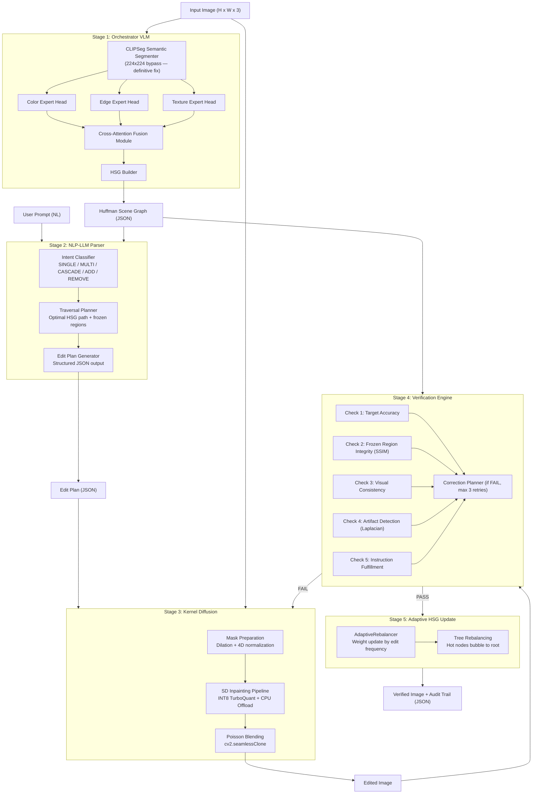

# SPECTRA Technical Architecture

> Production-grade VLM-driven closed-loop surgical image editing system.

---

## System Overview



---

## Component Deep Dives

### Stage 1 — Orchestrator VLM (`spectra_core/orchestrator_vlm.py`)

The orchestrator analyses the input image and constructs the **Huffman Scene Graph**.

**CLIPSeg Integration — Definitive Fix:**
The `CIDAS/clipseg-rd64-refined` processor defaults to 352×352 outputs but the downloaded model weights require 224×224. We bypass the processor's image path entirely:
```python
# Resize PIL image ourselves → convert to tensor → normalise with CLIP mean/std
# Then only call processor for text tokenisation (no image involved)
pixel_values = normalised_224_tensor.repeat(N_prompts, 1, 1, 1)
text_inputs  = processor(text=prompts, return_tensors="pt")
outputs      = model(pixel_values=pixel_values, **text_inputs)
```

**Three Expert Heads:**

| Head | Perceives | Output Attributes |
|---|---|---|
| **Color Expert** | Hue, saturation, gradients, shadows | `color_primary`, `hex`, `temperature`, `brightness_relative` |
| **Edge Expert** | Boundaries, contours, occlusion, depth | `boundary_type`, `sharpness`, `depth_ordering`, `continuity` |
| **Texture Expert** | Material class, grain, patterns, reflectivity | `material_class`, `roughness`, `pattern_type`, `reflectivity` |

**Hybrid Execution:**
- With `GEMINI_API_KEY`: Uses Gemini 2.5 Pro for deep scene understanding
- Without key: Falls back to local CLIPSeg (`CIDAS/clipseg-rd64-refined`) — 100% uptime

---

### Stage 2 — NLP-LLM Parser (`spectra_core/nlp_parser.py`)

Translates natural language instructions into structured **Edit Plans**.

**Intent Types:**

| Type | Example Prompt |
|---|---|
| `SINGLE_NODE` | "Change the hat color to red" |
| `MULTI_NODE` | "Make the entire outfit all black" |
| `CASCADE` | "Change lighting to sunset" (affects skin, shadows, sky) |
| `STRUCTURAL_ADD` | "Add sunglasses to her face" |
| `STRUCTURAL_REMOVE` | "Remove the hat" |
| `AMBIGUOUS` | System asks for clarification |

**Edit Plan JSON Schema:**
```json
{
  "type": "SINGLE_NODE",
  "confidence": 0.95,
  "target_nodes": ["hat_01"],
  "modifications": [
    { "node": "hat_01", "attribute_path": "color.primary", "new_value": "red" }
  ],
  "frozen_regions": ["face_01", "background"],
  "traversal_path": ["SCENE_ROOT", "person_01", "hat_01"],
  "affected_masks": ["hat_01.mask"]
}
```

---

### Stage 3 — Kernel Diffusion (`kernel_diffusion.py`)

Executes the surgical edit using Stable Diffusion Inpainting with full production hardening.

**Execution Path:**

```
Edit Plan + Original Image
         │
         ▼
1. Mask Preparation
   ├─ Ensure 4D tensor shape [1, 1, H, W]
   ├─ Binarize (> 0.5) to prevent CLIPSeg noise spread
   └─ Morphological Dilation (5% of largest dimension)

2. SD Inpainting (512×512 native)
   ├─ INT8 TurboQuant: load_in_8bit=True + device_map="auto"
   ├─ Fallback: FP32 Magic Upcast if INT8 fails (e.g., CPU-only)
   ├─ Identity Guard: strength=0.75 for person nodes (0.95 otherwise)
   └─ Feature-Guided Prompting: ZT/ZL/ZB → "highly detailed texture", etc.

3. Poisson Blending (seamless boundary harmonisation)
   ├─ cv2.seamlessClone with NORMAL_CLONE mode
   ├─ Finds mask centroid for clone center point
   └─ Fallback: alpha-blend if mask touches image border
```

**VRAM Budget (4 GB target):**

| Component | VRAM Usage |
|---|---|
| UNet (INT8) | ~1.8 GB |
| VAE | ~0.5 GB |
| CLIP Text Encoder | ~0.2 GB |
| Active Tensors | ~0.5 GB |
| **Total Peak** | **~3.0 GB** ✅ |

---

### Stage 4 — Verification Engine (`spectra_core/verification_engine.py`)

Re-analyses the edited image against the original using 5 rigorous checks.

**Verification Checks:**

```
Check 1: TARGET_ACCURACY
   └─ Compares expected attribute change vs. detected change in output HSG
   └─ PASS if target attribute is detectably different from original

Check 2: FROZEN_REGION_INTEGRITY
   └─ SSIM(original_frozen_pixels, edited_frozen_pixels)
   └─ PASS if global SSIM > 0.96 and all frozen node regions preserved

Check 3: VISUAL_CONSISTENCY
   └─ colour_range_ratio, brightness_preservation heuristics
   └─ PASS if edit doesn't violently disrupt scene balance

Check 4: ARTIFACT_DETECTION
   └─ Laplacian gradient variance on edited regions
   └─ artifact_score = mean(abs(laplacian)) / scene_baseline
   └─ PASS if artifact_score < 0.15

Check 5: INSTRUCTION_FULFILLMENT
   └─ VLM re-assessment OR heuristic from parser confidence
   └─ PASS if fulfillment_confidence > 0.85
```

**Correction Loop (max 3 retries):**
```
FAIL → CorrectionPlanner analyses failure report
     → Generates specific correction (e.g., "shift hue by -15°")
     → Back to Stage 3 with revised plan
     → Re-verify
     → After 3 failures: DELIVER with warning
```

**Verification Report JSON:**
```json
{
  "verification_result": "PASS",
  "overall_score": 0.9596,
  "elapsed_ms": 277,
  "checks": [
    { "name": "TARGET_ACCURACY",         "status": "PASS", "confidence": 0.85 },
    { "name": "FROZEN_REGION_INTEGRITY", "status": "PASS", "confidence": 1.0, "ssim": 1.0 },
    { "name": "VISUAL_CONSISTENCY",      "status": "PASS", "confidence": 0.998 },
    { "name": "ARTIFACT_DETECTION",      "status": "PASS", "confidence": 1.0, "artifact_score": 0.0 },
    { "name": "INSTRUCTION_FULFILLMENT", "status": "PASS", "confidence": 0.95 }
  ],
  "next_action": "DELIVER_TO_USER"
}
```

---

### Stage 5 — Adaptive HSG Update (`spectra_core/huffman_graph.py`)

After a verified edit, the HSG is updated so future edits on the same session are faster.

**Weight Update Formula:**
```python
# λ = 0.7 (learning rate)
# frequency_signal = 0.3 (edit frequency boost)
node.weight = 0.7 * current_weight + 0.3 * frequency_signal
```

**Tree Rebalancing — Before & After:**
```
BEFORE (user hasn't edited hat much):        AFTER (hat edited 5 times):
         [ROOT]                                      [ROOT]
         /  |  \                                    /   |   \
     Person  BG  Light                           Hat  Person  Light
     / | \                                       /    /  |  \
 Face Body Hat  ← depth 2                    Brim  Face Body  BG
                                             Hat is now at depth 1 — faster access
```

---

## Huffman Scene Graph (HSG) Structure

```json
{
  "id": "SCENE_ROOT",
  "weight": 1.0,
  "depth": 0,
  "global_attributes": {
    "lighting": "daylight_warm",
    "palette": ["#3B7DD8", "#8B4513"],
    "ambient_intensity": 0.8
  },
  "children": [
    {
      "id": "person_01",
      "label": "person",
      "weight": 0.95,
      "depth": 1,
      "bbox": [120, 50, 340, 480],
      "attributes": {
        "color": { "primary": "blue", "hex": "#3B7DD8" },
        "edge": { "boundary_type": "hard", "sharpness": 0.95 },
        "texture": { "material_class": "organic", "roughness": 0.3 }
      },
      "children": [
        { "id": "face_01", "weight": 0.92, "depth": 2 },
        { "id": "hat_01",  "weight": 0.70, "depth": 2 }
      ]
    },
    {
      "id": "background",
      "label": "background",
      "weight": 0.50,
      "depth": 1
    }
  ]
}
```

**Compression Levels:**
- **Depth 0–1**: 100% full attribute detail (active editing targets)
- **Depth 2**: 50% detail (context nodes)
- **Depth 3+**: Seed only (lazy-loaded on demand)

---

## Training Pipeline (Phase 2 Roadmap)

| Script | Dataset | Iterations | Purpose |
|---|---|---|---|
| `color_head_training.py` | MINC, Adobe Color | 50K | Color attribute prediction |
| `edge_head_training.py` | BSDS500, NYU Depth | 50K | Edge type + sharpness |
| `texture_head_training.py` | DTD, OpenSurfaces | 50K | Material classification |
| `fusion_training.py` | COCO-Panoptic, ADE20K | 100K | Joint panoptic segmentation |
| `hsg_construction_training.py` | Visual Genome + Synthetic | 200K | Tree structure prediction |
| `parser_finetuning.py` | 50K instruction-plan pairs | 50K | NLP Parser LoRA adapter |
| `synthetic_data_generator.py` | Procedural | 100K | HSG ground-truth generation |

---

## API Endpoints

```
POST /api/analyze   →  Stage 1 only (returns HSG)
POST /api/edit      →  Full 5-stage pipeline
POST /api/verify    →  Stage 4 only (takes two images + edit plan)
```

---

## File Map

```
spectra_core/
├── orchestrator_vlm.py      ← Stage 1: CLIPSeg + 3 Expert Heads + HSG Builder
├── nlp_parser.py            ← Stage 2: Intent Classifier + Traversal Planner
├── verification_engine.py   ← Stage 4: 5-check loop + Correction Planner
├── huffman_graph.py         ← HSG data structure + Adaptive Rebalancer
└── orchestrator_loop.py     ← Master control: sequences Stages 1-5

kernel_diffusion.py          ← Stage 3: SD Inpainting + Dilation + Poisson Blend
main_model.py                ← TurboQuant modules: tq_tex, tq_light, tq_bound
dynamic_orchestrator.py      ← Mask algebra: Target_Mask - Protected_Anatomy_Mask
```
